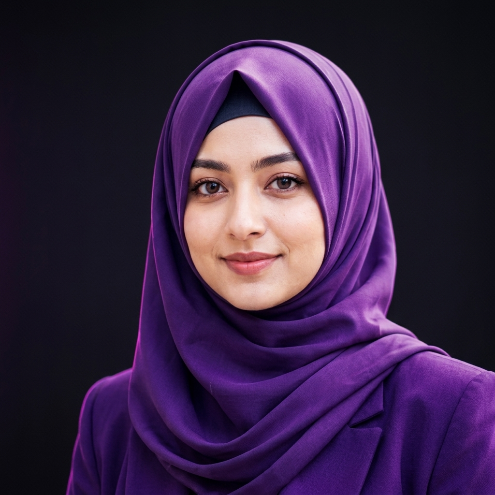

# Dono Rahimova — 3D Liquid Glass AI Portfolio

Zamonaviy **3D WebGL Canvas**, **Aylanuvchi 3D Shisha Kub**, **3D Flip Loyiha Kartalari** va **Liquid Glass (neon akril shisha)** optikasiga ega professional portfolio landing page.



## 🌟 Asosiy Xususiyatlar

- **🌌 Three.js 3D WebGL Sahnasi**: Interaktiv neon zarrachalar to'ri va suzuvchi 3D geometrik figuralar.
- **🧊 Aylanuvchi 3D Shisha Kub**: Dono Rahimovaning 6 ta yo'nalishini aks ettiruvchi, sichqoncha/barmoq bilan sudrab aylantiriladigan interaktiv kub.
- **🎴 3D Holo Shaffof Karta**: Nurlanuvchi neon qirralar, doiraviy nurlanuvchi avatar, 3D tilt va chuqurlik qatlamlari.
- **🔄 3D Flip Loyihalar**: Har bir loyiha 180° aylanib, haqiqiy **Prompt Blueprint** formulasini va natijalarini ko'rsatadi.
- **🧪 Prompt Lab (Playground)**: 4 toifa bo'yicha professional promptlar arxitekturasi va nusxalash.
- **🌐 3 Tilda Ishlash**: O'zbek, Rus va Ingliz tillarida bir zumda almashtirish (UZ / RU / EN).
- **📱 To'liq Moslashuvchan**: Barcha smartfonlar, planshetlar va katta ekranlar uchun to'liq responsive.

---

## 🛠 Texnologiyalar

- **HTML5** — Semantik va SEO optimallashtirilgan tuzilma.
- **CSS3 (Vanilla)** — 3D Transforms (`preserve-3d`, `perspective`), Liquid Glassmorphism, Neon Glow animatsiyalari.
- **JavaScript (ES6+)** — Three.js WebGL, 3D tilt, drag controls, i18n lug'ati va kontakt formasi.
- **Three.js** — Haqiqiy 3D fazo va zarrachalar renderi.

---

## 🚀 Mahalliy Ishga Tushirish

1. Ushbu repozitoriyani klonlang:
```bash
git clone https://github.com/USERNAME/portfolio.git
cd portfolio
```

2. Brauzerda ochish:
To'g'ridan-to'g'ri `index.html` faylini oching yoki mahalliy server orqali ishga tushiring:
```bash
python -m http.server 8080
```
Brauzerda `http://localhost:8080/` manziliga kiring.

---

## 📬 Aloqa

- **Dasturchi / Mutaxassis**: Dono Rahimova (Najot Ta'lim bitiruvchisi)
- **Yo'nalish**: Prompt Engineering & AI Content Creation
- **Telefon**: [+998 97 754 09 79](tel:+998977540979)
- **Telegram**: [@donoraximova_ai](https://t.me/donoraximova_ai)

---
© 2026 Dono Rahimova. Barcha huquqlar himoyalangan.
